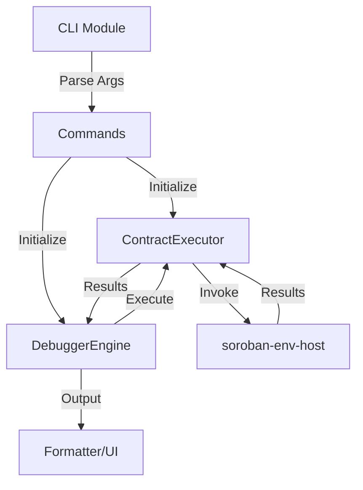
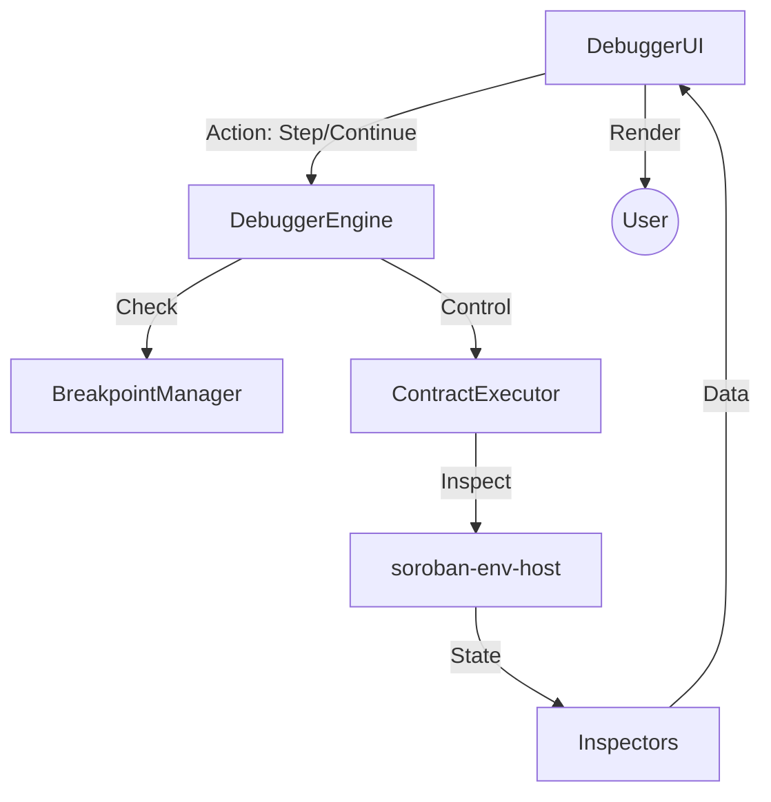

# Soroban Debugger Architecture

This document provides a high-level overview of the `soroban-debugger` system design, module responsibilities, and data flow.

## System Overview

The `soroban-debugger` is a specialized tool designed to facilitate the debugging of Soroban smart contracts. It provides both a command-line interface (CLI) for quick execution and inspection, and an interactive Terminal User Interface (TUI) for step-by-step debugging.

The goal is to provide developers with deep visibility into contract execution, resource usage, and state changes within a controlled test environment.

## Module Breakdown

The project is structured into several core modules, each with dedicated responsibilities:

### 1. `cli`
- **Responsibility**: Handles command-line argument parsing and command dispatching.
- **Key Components**: `Args`, `Commands`.
- **Function**: Translates user input from the terminal into actions performed by the debugger engine.

### 2. `debugger`
- **Responsibility**: The heart of the debugger. Orchestrates the debugging session.
- **Key Components**:
  - `DebuggerEngine`: Coordinates between the executor, breakpoint manager, and debug state.
  - `BreakpointManager`: Manages set breakpoints and evaluates if execution should pause.
  - `DebugState`: Maintains the current state of the debugging session (e.g., current function, pause status).
  - `Stepper`: (Planned) Logic for stepping through instructions.

### 3. `runtime`
- **Responsibility**: Manages the execution environment for Soroban contracts.
- **Key Components**:
  - `ContractExecutor`: Uses `soroban-env-host` to register and invoke contracts in a test environment.
- **Function**: Executes WASM bytecode and provides access to the underlying `Host` for inspection.

### 4. `inspector`
- **Responsibility**: Tools for examining the state of the execution environment.
- **Key Components**:
  - `BudgetInspector`: Tracks CPU and memory usage (budget).
  - `StackInspector`: Analyzes the call stack during execution.
  - `StorageInspector`: Examines contract storage (ledger entries).

### 5. `ui`
- **Responsibility**: Handles presentation of information to the user.
- **Key Components**:
  - `DebuggerUI`: Implementation of the TUI using `ratatui` (or similar).
  - `Formatter`: Pretty-printing and formatting of contract values and state.

### 6. `utils`
- **Responsibility**: Common utility functions used across the project.

---

## Data Flow

### Command Execution Flow

When a user runs a command like `soroban-debugger run`, the data flows as follows:

### Interactive Debugging Flow

In interactive mode, the flow involves the user interacting with the UI:

---

## Key Design Decisions

1. **Direct `soroban-env-host` Integration**: We integrate directly with the Soroban host environment to get fine-grained control and access to internal states (budget, storage) that higher-level SDKs might abstract away.
2. **Separation of Engine and Executor**: By decoupling the debugging logic (`DebuggerEngine`) from the execution environment (`ContractExecutor`), we make the system more modular and easier to test.
3. **Inspector Pattern**: Using dedicated inspector modules allows us to add new ways to visualize contract state without cluttering the core execution logic.

---

## Extension Points

Future contributors can extend the debugger in several ways:

- **New Commands**: Add new subcommands to the `cli` module to support different debugging workflows.
- **Custom Inspectors**: Create new inspectors in the `inspector` module to track specific resources or state types (e.g., event logs).
- **UI Enhancements**: Improve the TUI in the `ui` module to provide better visualization of complex data structures or execution paths.
- **Backend Adapters**: (Future) Extend `ContractExecutor` to support connecting to remote RPC nodes for live debugging.
