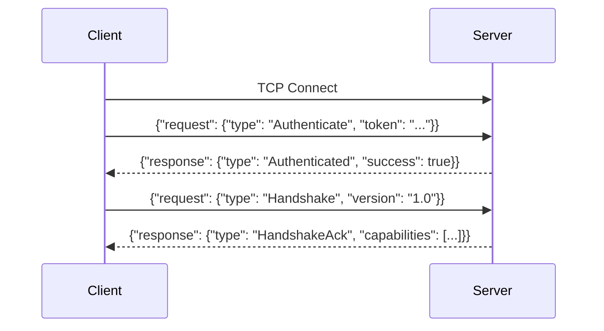
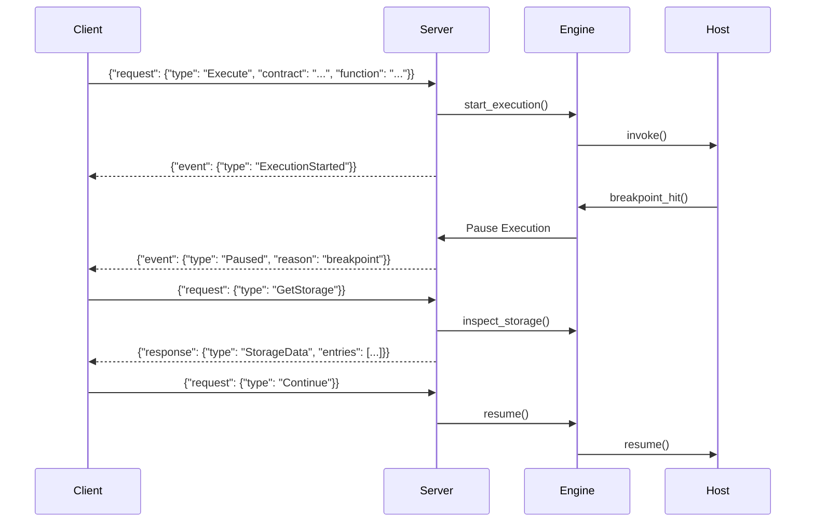

# Remote Debugging Architecture

The Soroban Debugger supports a client-server architecture to enable remote debugging. This allows the debugger engine (server) to run in one environment (e.g., a CI sandbox or remote server) while the user interfaces with it from another (e.g., local CLI or VS Code extension).

## Subsystem Overview

The remote debugging subsystem consists of three main components:

1. **Debug Server**: The host process running `soroban-debug server`. It encapsulates the `DebuggerEngine` and listens for incoming TCP connections.
2. **Remote Client**: The process connecting to the server. This can be the `soroban-debug remote` CLI command or the VS Code Extension (acting as a Debug Adapter Protocol proxy).
3. **Wire Protocol**: A line-delimited JSON RPC protocol over TCP used for communication between the client and server.

## Data Flow

### Connection and Authentication Flow

### Execution and Inspection Flow

Once authenticated, the client acts as a remote control for the `DebuggerEngine`.

## VS Code Extension (DAP) Integration

The VS Code extension integrates with the remote debugging subsystem by acting as a Debug Adapter Protocol (DAP) proxy:

1. **Launch**: VS Code starts the extension.
2. **Spawn**: The extension spawns `soroban-debug server` as a local subprocess.
3. **Attach**: The extension connects to the spawned server over TCP.
4. **Translation**: The extension translates DAP requests from VS Code (e.g., `variables`, `continue`) into the corresponding wire protocol requests (`GetStorage`, `Continue`) for the server, and translates server events back to DAP events.

## Security and Transport

- **Authentication**: Token-based authentication prevents unauthorized execution.
- **Transport Security**: TLS support is provided natively by the server (`--tls-cert`, `--tls-key`) or can be handled via external tunnels (e.g., SSH, reverse proxies).