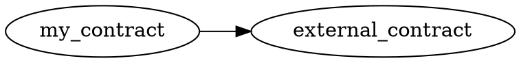

# Contract Dependency Graph

Use the `inspect` command with `--dependency-graph` to extract cross-contract
call patterns from a compiled WASM module and export them in both DOT and
Mermaid formats.

## Usage

```bash
soroban-debug inspect --contract target/wasm32-unknown-unknown/release/my_contract.wasm --dependency-graph
```

## Example DOT Output



## Example Mermaid Output

```mermaid
graph LR
  "my_contract" --> "external_contract"
```
